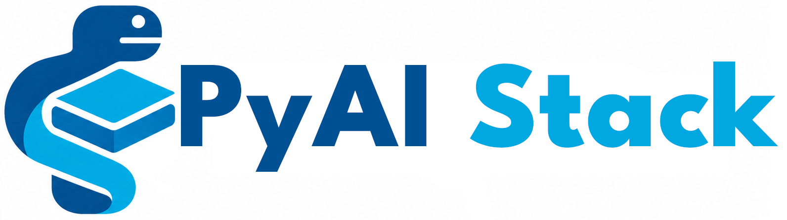

<p align="center">
  
</p>

<p align="center">
  ⚡ A lightweight, modular microframework for complete AI applications.
</p>

PyAIStack helps you build RAG, agents, agentic tools, AI features, and provider integrations faster. The current release provides a production-oriented foundations with local Ollama and Gemma models by default.

## ✨ Start simple

```python
from pyaistack import RAG

rag = RAG(
    embedding_model="embeddinggemma",
    llm_model="gemma3:4b",
)

rag.add([
    "AWS Lambda is a serverless compute service.",
    "Amazon S3 is an object storage service.",
])

answer = rag.ask("Which service runs code without managing servers?")
print(answer.text)
```

## 📁 Load, chunk, and persist local knowledge

Load a directory of UTF-8 `.txt` files, split documents before indexing, and retain the index in one SQLite file:

```python
from pyaistack import RAG
from pyaistack.chunking import TextChunker
from pyaistack.loaders import DirectoryLoader
from pyaistack.vectorstores import SQLiteVectorStore

documents = DirectoryLoader("knowledge", file_type="text").load()

rag = RAG(
    vector_store=SQLiteVectorStore("knowledge.db"),
    chunker=TextChunker(chunk_size=1_000, chunk_overlap=150),
)
rag.add_documents(documents)
```

`file_type` is required. This release implements only `text`; PDF, DOCX, Markdown, and web loaders will be added only when implemented. `SQLiteVectorStore` uses exact cosine search and is intended for local, small-to-medium indexes.

### Project links

- [GitHub repository](https://github.com/pyaistack/pyaistack)
- [Documentation](https://pyaistack.appvrs.com)
- [Changelog](https://pyaistack.appvrs.com/release-notes/)
- [LinkedIn — Prashant Band](https://www.linkedin.com/in/prashantband/)

## 🧠 Requirements

- Python 3.10+
- Ollama running locally
- Ollama version compatible with `embeddinggemma` (the Ollama model page currently specifies v0.11.10+)

Pull the default models:

```bash
ollama pull embeddinggemma
ollama pull gemma3:4b
```

## 🚀 Install

```bash
python -m venv .venv
source .venv/bin/activate
pip install pyaistack
```

For development:

```bash
pip install -e ".[dev]"
```

## ▶️ Run

```bash
python examples/basic/basic_rag.py
```

### How it works

```text
documents
   │
   ▼
OllamaEmbeddingProvider
   │
   ▼
InMemoryVectorStore

question
   │
   ▼
embedding
   │
   ▼
cosine retrieval
   │
   ▼
Top-K sources
   │
   ▼
context builder
   │
   ▼
OllamaChatProvider
   │
   ▼
RAGAnswer(text + sources)
```

## 📊 Optional observability

Attach an observer only when your application needs sanitized timing and operation events:

```python
from pyaistack import RAG
from pyaistack.observability import LoggingObserver

rag = RAG(observers=[LoggingObserver()])
```

No events are created when no observer is configured. See the
[observability guide](docs/docs_pyaistack/rag/observability.md) and
[runnable example](examples/observability/rag_events.py).

## 🔧 Change the embedding model

Only configuration changes:

```python
rag = RAG(
    embedding_model="qwen3-embedding:0.6b",
    llm_model="gemma3:4b",
)
```

or:

```python
rag = RAG(
    embedding_model="nomic-embed-text",
    llm_model="gemma3:4b",
)
```

> Note: Do not change embedding models while an index contains vectors. Different models may produce different vector dimensions and, more importantly, incompatible vector spaces. Clear/rebuild the index when changing the embedding model.

## ✍️ Add application instructions

You can append instructions specific Prompt sufix to your application:

```python
rag = RAG(system_prompt_suffix="Answer with concise bullet points.")
```

## 🌐 Configure Ollama host

```python
rag = RAG(
    embedding_model="embeddinggemma",
    llm_model="gemma3:4b",
    ollama_host="http://192.168.1.20:11434",
)
```

## 🔎 Access retrieval results without generating

```python
results = rag.search("serverless compute", top_k=3)

for result in results:
    print(result.score)
    print(result.document.text)
    print(result.document.metadata)
```

## 🏷️ Add metadata

```python
rag.add(
    ["Leave policy text", "Travel policy text"],
    metadatas=[
        {"file": "leave-policy.pdf", "page": 3},
        {"file": "travel-policy.pdf", "page": 7},
    ],
)
```

Use normalized metadata filtering with either retrieval or answer generation.
When stored metadata is a list, a scalar filter matches one list value:

```python
results = rag.search(
    "What is the leave policy?",
    metadata_filter={"department": "engineering"},
)

answer = rag.ask(
    "What is the leave policy?",
    metadata_filter={"department": "engineering"},
)
```

`LLMMetadataFactory` stores generated values as normalized lists, for example
`{"category": ["sustainability"], "language": ["en"]}`.

For large text directories, generate metadata automatically with
`FolderMetadataFactory` from folder names, `CSVMetadataFactory` from a
metadata manifest, or `LLMMetadataFactory` from a bounded file sample. Use
`DirectoryLoader.iter_load()` with
`rag.add_documents([document])` to process one file at a time. See
[loaders and chunking](docs/rag/loaders-and-chunking.md).

## ⚙️ Configure retrieval

```python
from pyaistack import RAG, RAGConfig

rag = RAG(
    config=RAGConfig(
        top_k=5,
        min_score=0.25,
        max_context_chars=20_000,
        include_sources=True,
    )
)
```

## 💬 Friendly errors

Use `format_error` at your application entry point to show the relevant application line without PyAIStack implementation frames:

```python
from pyaistack import RAG, format_error
from pyaistack.exceptions import ProviderError

rag = RAG()

try:
    rag.add(["A document to index."])
except ProviderError as error:
    print(format_error(error))
```

For example, a missing embedding model is displayed as:

```text
Traceback (most recent call last):
  File "/path/to/app.py", line 8, in <module>
    rag.add(["A document to index."])
pyaistack.exceptions.ProviderError: Model "embeddinggemma" is not available.
Run: ollama pull embeddinggemma
```

## 📄 License

Apache License 2.0. See [LICENSE](LICENSE).
